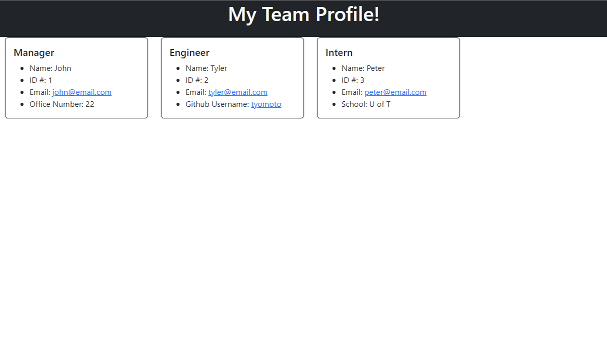
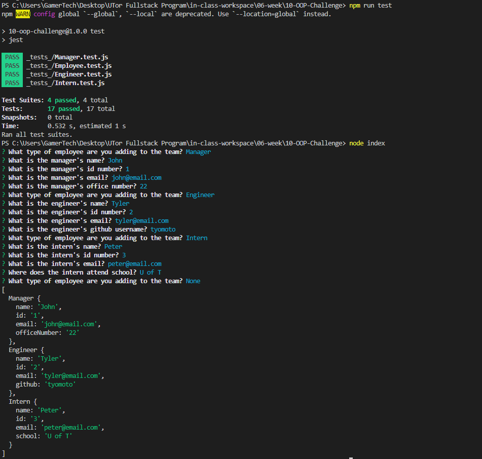

# 10 Object-Oriented Programming: Team Profile Generator
## Module 10 Challenge

## Description
The goal of this challenge was to create a Team Profile Generator, where the user interacts with a command-line application that will take in information about employees. The data collected from the users inputs will then be output to display a card summary of each employee in an html page.

## User Story
AS A manager
I WANT to generate a webpage that displays my team's basic info
SO THAT I have quick access to their emails and GitHub profiles

## Acceptance Criteria
GIVEN a command-line application that accepts user input
* WHEN I am prompted for my team members and their information
    - THEN an HTML file is generated that displays a nicely formatted team roster based on user input
* WHEN I click on an email address in the HTML
    - THEN my default email program opens and populates the TO field of the email with the address
* WHEN I click on the GitHub username
    - THEN that GitHub profile opens in a new tab
* WHEN I start the application
    - THEN I am prompted to enter the team manager’s name, employee ID, email address, and office number
* WHEN I enter the team manager’s name, employee ID, email address, and office number
    - THEN I am presented with a menu with the option to add an engineer or an intern or to finish building my team
* WHEN I select the engineer option
    - THEN I am prompted to enter the engineer’s name, ID, email, and GitHub username, and I am taken back to the menu
* WHEN I select the intern option
    - THEN I am prompted to enter the intern’s name, ID, email, and school, and I am taken back to the menu
* WHEN I decide to finish building my team
    - THEN I exit the application, and the HTML is generated

## Installation
First install all dependencies:
```
npm install
```
Open terminal to run the tests with:
```
npm run test
```
Start the Application with:
```
node index
```

## Screenshot



## Video Walkthrough
This link will take you to the video walkthrough and demonstration in how to use this team generator as well as the npm tests passing.
[README Walkthrough](https://drive.google.com/file/d/1un6hLLsLGzCzDuWBlSZz2Jh14MHR-Eyo/view)

## Website
This [link](https://github.com/tyomoto/furry-spoon) will take you to the code repository on github.